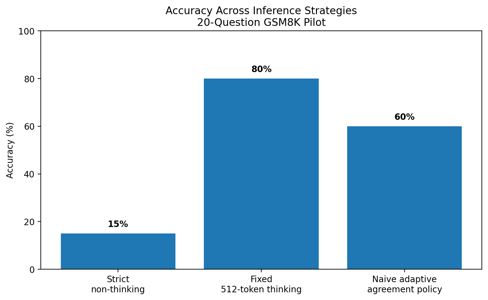
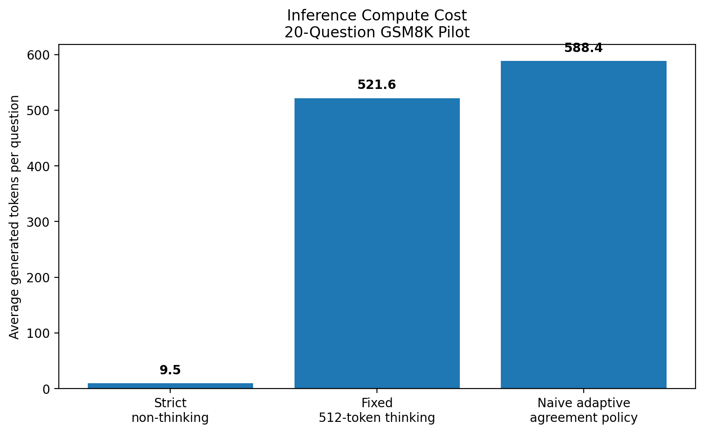
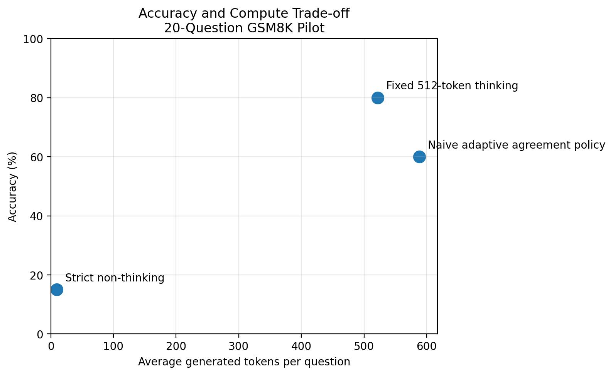
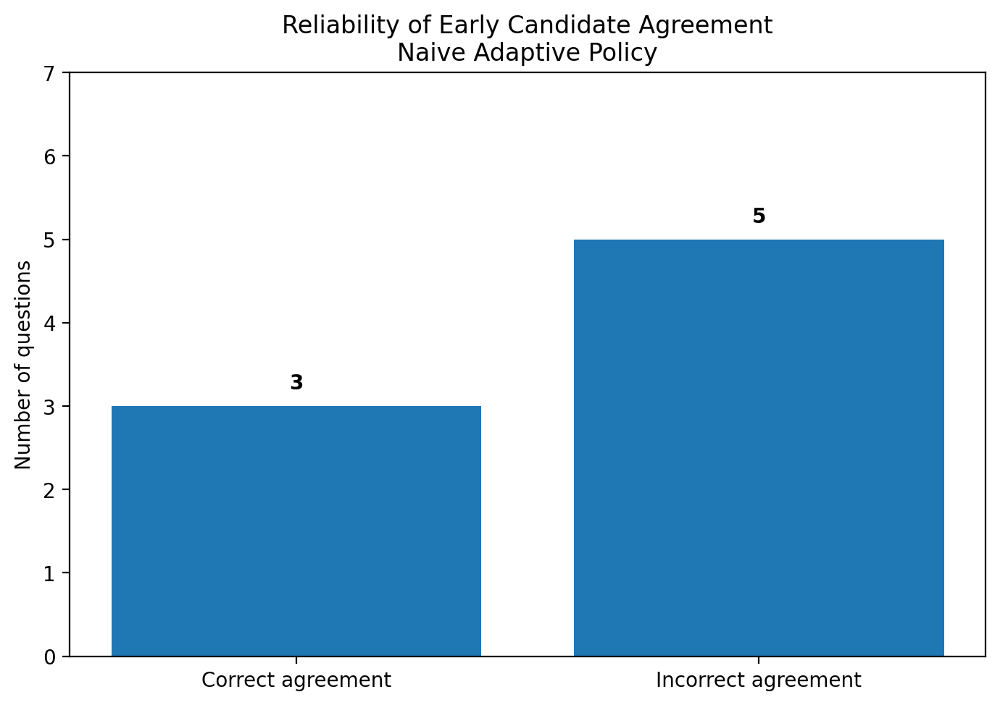

# Think, Verify, Stop

## A Small-Scale Study of Adaptive Test-Time Compute in Open Reasoning Models

[](https://colab.research.google.com/github/alsammachm/adaptive-test-time-reasoning/blob/main/notebooks/adaptive_test_time_reasoning.ipynb)

[](report/Think_Verify_Stop_Technical_Report.pdf)

This independent research and engineering project investigates how inference-time reasoning affects mathematical problem-solving in an open reasoning model.

The study compares three inference strategies:

1. A strict non-thinking baseline
2. A fixed 512-token reasoning strategy
3. A naive adaptive policy that allocates additional computation when two short reasoning attempts disagree

The central question is:

> Can an adaptive inference policy preserve the accuracy benefits of extended reasoning while reducing unnecessary computation?

The pilot produced an important negative result. Agreement between two short reasoning attempts was not a reliable confidence signal because both attempts frequently converged on the same incorrect answer.

---

## Key Results

The experiment used a reproducibly sampled set of 20 questions from the GSM8K test split.

| Strategy | Accuracy | Correct | Average Generated Tokens | Average Time |
|---|---:|---:|---:|---:|
| Strict non-thinking | 15% | 3/20 | 9.5 | 1.45 s |
| Fixed 512-token thinking | 80% | 16/20 | 521.6 | 47.00 s |
| Naive adaptive agreement policy | 60% | 12/20 | 588.4 | 54.27 s |

### Main finding

The fixed reasoning strategy achieved the highest accuracy.

The naive adaptive strategy consumed more tokens and produced lower accuracy. Of the eight questions where two short reasoning candidates agreed, only three agreements were correct. Five were confidently wrong.

This suggests that simple answer agreement is insufficient as a stopping criterion when sampled reasoning paths share correlated errors.

---

## Accuracy Comparison



## Computation Cost



## Accuracy and Compute Trade-off



## Reliability of Candidate Agreement



---

## Research Questions

This pilot study examines three questions:

1. How much does explicit inference-time reasoning improve accuracy over a direct-answer baseline?
2. Can agreement between independently sampled short reasoning attempts serve as a reliable confidence signal?
3. Can a disagreement-triggered adaptive policy improve the accuracy-compute trade-off relative to a fixed reasoning budget?

---

## Hypotheses

### H1

Increasing inference-time computation will substantially improve accuracy over strict direct-answer generation.

### H2

Two short reasoning attempts will sometimes agree on the same incorrect answer because their errors are correlated.

### H3

A naive agreement-based adaptive policy may fail to outperform fixed reasoning unless its stopping decision incorporates stronger verification signals.

---

## Methodology

### Model

- `Qwen/Qwen3.5-4B`
- Four-bit NF4 quantization
- Half-precision computation
- NVIDIA Tesla T4 GPU
- Thinking mode enabled for reasoning experiments

### Benchmark

- GSM8K test split
- 20-question reproducible pilot sample
- Fixed sample indices
- Random seed: `2026`

### Strategy 1: Strict Non-Thinking

The model receives an answer-only system instruction and returns a boxed numeric answer without an explicit reasoning phase.

### Strategy 2: Fixed Reasoning

Every question receives:

- A maximum 512-token reasoning budget
- A separate deterministic answer-finalization step
- The same general inference allocation regardless of difficulty

### Strategy 3: Naive Adaptive Agreement

Each question initially receives two independently sampled 128-token reasoning attempts.

- If both answers agree, the system stops early.
- If they disagree, the question is escalated to a 512-token reasoning attempt.
- A deterministic finalizer extracts the final numeric answer.

### Evaluation Metrics

- Exact numerical accuracy
- Generated-token count
- Generation time
- Early agreement rate
- Escalation rate
- Correct and incorrect early agreements

---

## Interpretation

The experiment confirms that additional reasoning can dramatically improve performance. Accuracy increased from 15% under strict non-thinking generation to 80% under the fixed 512-token reasoning strategy.

However, the adaptive experiment also demonstrates that more elaborate inference logic is not automatically more efficient or reliable.

The naive policy assumed that agreement between two short reasoning attempts indicated confidence. In practice, both attempts often made the same systematic mistake. This caused the policy to stop early on incorrect answers.

The result motivates stronger adaptive mechanisms based on signals such as:

- Independent process verifiers
- Step-level uncertainty
- Tool-assisted arithmetic validation
- Model diversity
- Calibrated confidence estimates
- Learned stopping policies
- Semantic comparison of reasoning paths
- External symbolic checking

---

## Limitations

This is an exploratory pilot rather than a comprehensive benchmark.

Important limitations include:

- Only 20 GSM8K questions were evaluated.
- Only one model was tested.
- Four-bit quantization may affect model performance.
- Runtime was measured on a shared Google Colab T4 environment.
- The adaptive policy used answer agreement rather than an independent verifier.
- The reasoning samples came from the same model and may therefore exhibit correlated errors.
- No statistical significance claim is made.
- Results should not be generalized beyond this experimental configuration.

---

## Repository Structure

```text
adaptive-test-time-reasoning/
│
├── README.md
├── LICENSE
├── notebooks/
│   └── adaptive_test_time_reasoning.ipynb
└── results/
    ├── adaptive_policy_diagnostics.csv
    ├── adaptive_policy_results.csv
    ├── fixed_512_thinking_results.csv
    ├── pilot_research_note.txt
    ├── strategy_comparison_summary.csv
    ├── strict_non_thinking_results.csv
    └── figures/
        ├── accuracy_compute_tradeoff.png
        ├── average_token_cost.png
        ├── early_agreement_reliability.png
        └── strategy_accuracy_comparison.png
```
---

## Reproducing the Experiment

1. Open the notebook using the Colab badge at the top of this page.
2. Select a T4 GPU runtime.
3. Create a Hugging Face read token.
4. Store the token in Colab Secrets as `HF_TOKEN`.
5. Run the notebook cells in sequence.
6. Review the generated CSV results and figures.

Google Colab hardware availability and runtime performance may vary.

---

## Research Integrity Statement

This is an independent personal research and engineering project.

The project does not claim to introduce a new state-of-the-art algorithm. Its contribution is a transparent and reproducible pilot evaluation of fixed and adaptive inference strategies.

All reported results were generated through the experiments included in this repository. Negative findings are reported without alteration. Any AI-assisted development or writing was reviewed, tested, and validated by the author, who accepts responsibility for the final work.

---

## Author

**Mohammed Al Sammach**

AI and software engineering professional interested in reasoning models, adaptive inference, verification, and trustworthy intelligent systems.

---

## License

This repository is released under the MIT License.
